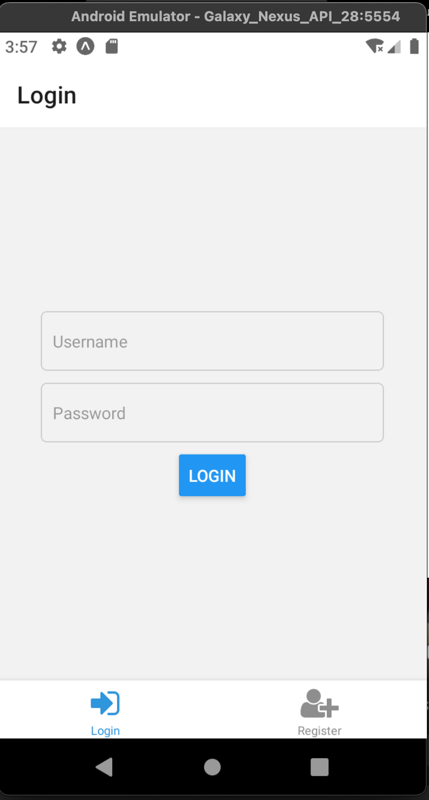
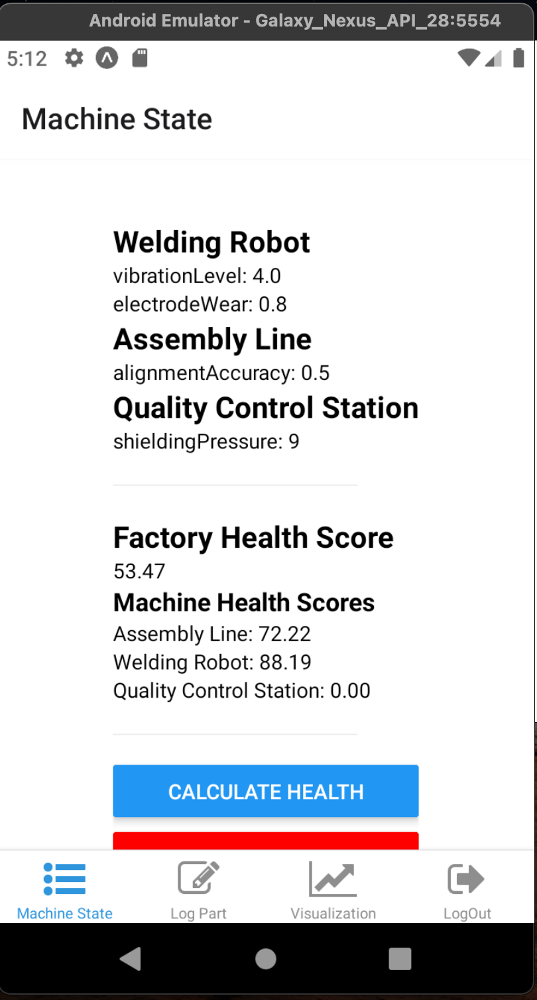
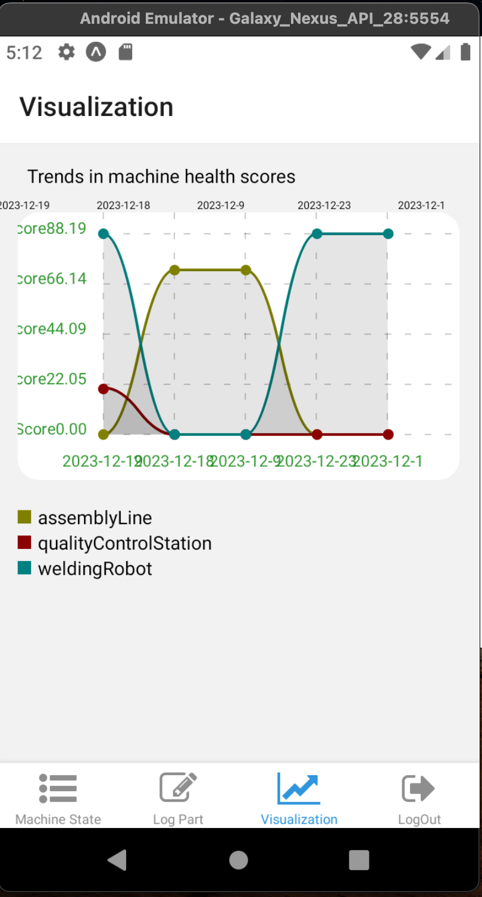

## Frontend Changes
-----------
## Set backend API url

- Set backend url in [`authService.tsx`](./app/(tabs)/authService.tsx); Although there is an entry in `index.tsx`, I declared a different variable to keep things seperate, feel free to reuse the existing variable.

## Installation

Follow these steps to set up :

1. Navigate to the project directory:

   ```bash
   cd native-app
   ```

2. Install dependencies using Yarn (or npm if you prefer):

   ```bash
   yarn
   ```
### Starting the APP

To run the following command:

```bash
yarn start
```

## Note
* I have replace `expo-router` to `react-navigation/bottom-tabs` for Tab layout. The bottom tabs dynamically display based on the authentication status.

### Authentication and Session Management:
* Two components, [`registrationScreen`](./app/(tabs)/registrationScreen.tsx) and [`loginScreen`](./app/(tabs)/loginScreen.tsx), handle user registration and login, respectively. The corresponding API calls (`registerUser` and `loginUser`) are implemented in ['authService`](./app/(tabs)/authService.tsx).
  
  #### Screenshots:

  
  

  After successful login, the application includes the following components:
  1. Machine Health (`index.tsx`)
  2. Log Part (`two.tsx`)
  3. Visualization ([`historyChart.tsx`](./app/(tabs)/historyChart.tsx))
  4. Logout ([`logOutScreen.tsx`](./app/(tabs)/logOutScreen.tsx))

 
 

> User session is managed by placing the login token in the session storage. When a user logs out, this token is then cleared out. 

## Data State Management
Data is stored in the states returned by the API. The state management system updates and manages the state as new data points and scores are fetched.

## Stretch Goals - (Visualizations)
The application fetches data using the `fetchHistoryDataPoints` API and utilizes the `react-native-chart-kit` library to display charts representing trends in machine health scores.
